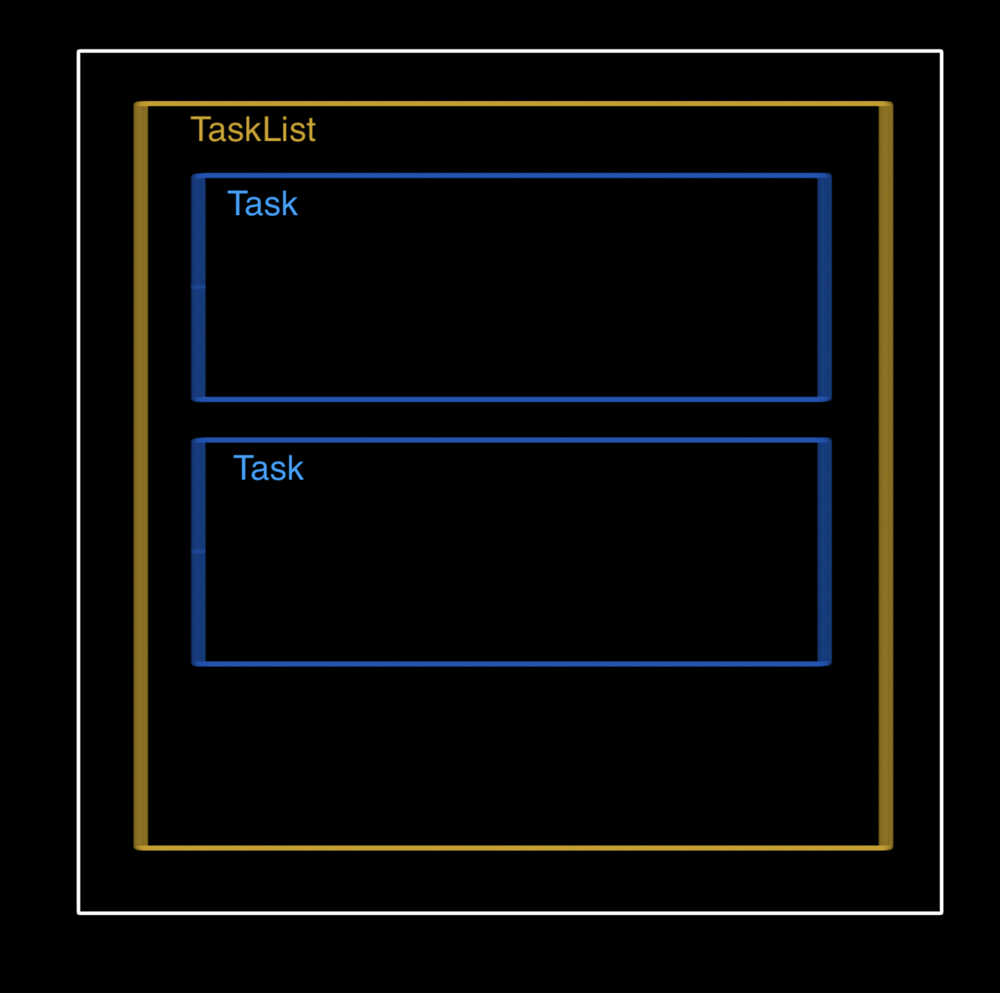

# Introduction to Vue.js

Learn how to build <a href="https://trouni-vue-task-manager.netlify.app/" target="_blank">this simple Todo app</a>.

---

## Setup

**TODO:**

Clone the git repository for this workshop and get into the project folder.

```sh
gh repo clone SuzukiRyuichiro/vue-tutorial-todo

cd vue-tutorial-todo
```

---

**TODO:**

Run `yarn install` to install the project's dependencies, then `yarn dev` to launch a local server.

```sh
yarn install # Installs dependencies

yarn dev # Compiles and hot-reloads for development
```

You should now be able to view your app on http://localhost:5173/

---

### Optional Setup

Not required, but you can also install these useful tools:

- [Volar](https://marketplace.visualstudio.com/items?itemName=Vue.volar) for syntax highlighting, snippets, _etc._ in VS Code.
- [Vue.js devtools](https://chrome.google.com/webstore/detail/vuejs-devtools/nhdogjmejiglipccpnnnanhbledajbpd), a Chrome extension to debug your Vue app from the browser.

---

## Intro to Vue Components

### Component File Structure

```html
<!-- Component.vue -->
<template>
  <!-- HTML structure -->
</template>

<script>
  // Data & logic
</script>

<style>
  /* Styling */
</style>
```

---

## Let's think about the app structure



---

⚠️ The `<template>` should only have a **single** root element.

### Creating your first components

Create a new `/components/TasksList.vue`.

```html
<!-- TasksList.vue -->

<template>
  <div>
    <p>This is my first Vue.js component</p>
  </div>
</template>
```

---

Then import the component in your `App.vue` file.

```html
<!-- App.vue -->
<script>
  import TaskList from "./components/TaskList.vue";

  export default {
    components: { TaskList },
  };
</script>

<template>
  <div class="container">
    <TaskList />
  </div>
</template>

<style scoped lang="scss">
  div.container {
    display: flex;
    flex-direction: column;
    justify-content: center;
    align-items: center;
    height: 100%;
  }
</style>
```

---

Let's replace the text with a static card:

```html
<!-- TasksList.vue -->

<template>
  <div>
    <div class="task-card">
      <div>
        <h3>Create a card component</h3>
        <p>
          Create a new TaskCard.vue file in the components folder, then import
          it in TasksList.vue
        </p>
      </div>
    </div>
  </div>
</template>
```

---

### Styling components

You can add styling rules for each component in the `<style>` section. Try it out!

You can use this styling I prepared for the card, but we should first move the task card into its own component. Move the previous code into a `TaskCard.vue` and add this styling:

---

## Making dynamic components

### Defining the State of a Component with `data`

Let's define some `data` and use the mustaches `{{ }}` to interpolate the values in our HTML template.

**💡Tip**: Install the awesome [Vue.js devtools](https://chrome.google.com/webstore/detail/vuejs-devtools/nhdogjmejiglipccpnnnanhbledajbpd), a Chrome extension to inspect data (and more) in your Vue app.

---

```vue
<!-- TaskCard.vue -->

<template>
  <div class="task-card">
    <div>
      <h3>{{ title }}</h3>
      <p>{{ description }}</p>
    </div>
    <div>{{ done ? "✅" : "⭕️" }}</div>
  </div>
</template>

<script>
export default {
  data() {
    return {
      title: "Make the card component dynamic",
      description:
        "Learn about using the data option and passing data to child components using props",
      done: false,
    };
  },
};
</script>
```

---

**We want our component to be reusable:**

Let's assign the `title` and `description` dynamically.

---

### Passing Data to Child Components with `props`

> Props are custom attributes you can register on a component. When a value is passed to a prop attribute, it becomes a property on that component instance.

Props are basically special data attributes **that come from the parent component**.

---

Let's replace the `data` option with `props`:

```js
// TaskCard.vue <script>

export default {
  props: {
    title: String,
    description: String,
    done: { type: Boolean, default: false },
  },
};
```

---

We can now pass the `title` and `description` from the parent component:

```html
<!-- TasksList.vue <template> -->

<TaskCard
  title="Make the card component dynamic"
  description="Learn about using the data option and passing data to child components using props"
  done="true"
/>
```

---

## Vue Directives

Add some static tasks to help us implement our app:

```js
// TasksList.vue <script>

data() {
  return {
    tasks: [
      {
        title: "Create a card component",
        description:
          "Create a new TaskCard.vue file in the components folder, then import it in TasksList",
        done: true,
      },
      {
        title: "Make the card component dynamic",
        description:
          "Learn about using the data option and passing data to child components using props",
        done: true,
      },
      {
        title: "Bind the attributes to the data",
        description:
          "Use the v-bind directive to bind the title and description to our data",
        done: false,
      },
    ],
  };
},
```

---

### Binding Attributes to Props and Data with `v-bind`

We want to use the values from our `tasks` in the `title` and `description` attributes of our `TaskCard` component, but mustaches cannot be used inside HTML attributes.

Instead, use a `v-bind` directive (shorthand `:`).

```html
<!-- TasksList.vue <template> -->

<TaskCard
  v-bind:title="tasks[0].title"
  v-bind:description="tasks[0].description"
  v-bind:done="tasks[0].done"
/>
```

---

### Binding HTML Classes

We can bind the class attribute to add a `done` class to the card when the task is completed.

```html
<!-- TaskCard.vue <template> -->

<div :class="['task-card', { done }]"></div>
```

---

### Iterate with `v-for`

Let's now display all of our tasks by iterating over the `tasks` array using the `v-for` directive.

```html
<!-- TasksList.vue <template> -->

<TaskCard
  v-for="(task, index) in tasks"
  :key="index"
  :title="task.title"
  :description="task.description"
  :done="task.done"
/>
```

---

### Conditional Rendering with `v-if` / `v-else`

Let's display a small message when we have no tasks in our app.

```html
<!-- TasksList.vue <template> -->

<div v-if="tasks.length > 0" class="tasks-list">
  <TaskCard ... />
</div>
<p v-else>You don't have any tasks yet...</p>
```

---

### Adding Behavior with `methods`

Implement an `addTask()` method to push a new task inside of the `tasks` array.

```js
// TasksList.vue <script>

// ...
methods: {
  addTask(title, description, done = false) {
    this.tasks.unshift({ title, description, done });
  },
},
// ...
```

---

### Listen for events with `v-on`

Let's add a button to test that our method works and make it listen to `click` events using `v-on` (shorthand `@`).

```html
<!-- TasksList.vue <template> -->

<button
  class="btn round-icon"
  v-on:click="addTask('My new task', 'My new description')"
>
  ＋
</button>
```

---

### Capturing user input with `v-model`

We still need to be able to enter the `title` and `description` ourselves. Let's add some inputs to our `TasksList`.

```html
<!-- TasksList.vue <template> -->

<div class="task-card new-task">
  <div>
    <input type="text" placeholder="What would you like to do?" />
    <textarea placeholder="Add some details about your task..."></textarea>
  </div>
</div>
```

---

Add the following styles to your `TasksList` component:

```vue

```

---

We can bind the input fields with data attributes in our component.

```vue
<!-- TasksList.vue -->

<template>
  <!-- ... -->
  <input
    type="text"
    placeholder="What would you like to do?"
    v-model="newTitle"
  />
  <textarea
    placeholder="Add some details about your task..."
    v-model="newDescription"
  ></textarea>
  <!-- ... -->
</template>

<script>
export default {
  data() {
    return {
      tasks: [],
      newTitle: "",
      newDescription: "",
    };
  },
};
</script>
```

---

### Update the `v-on` directive

```vue
<!-- TasksList.vue -->

<template>
  <!-- ... -->
  <button
    class="btn round-icon"
    @click="addTask(newTitle, newDescription), resetForm()"
  >
    ＋
  </button>
  <!-- ... -->
</template>

<script>
// ...
methods: {
  addTask(title, description, done = false) {
    this.tasks.unshift({ title, description, done });
  },
  resetForm() {
    this.newTitle = ""
    this.newDescription = ""
  }
},
// ...
</script>
```

---

### Manipulate the DOM by combining `v-on` and `v-if`/`v-show`

Let's only show the inputs after we click on the `+` button.

```vue
<template>
  <div id="tasks">
    <button class="btn round-icon" @click="newFormVisible = !newFormVisible">
      {{ newFormVisible ? "✕" : "＋" }}
    </button>

    <div
      v-show="newFormVisible"
      class="task-card new-task"
      @keyup.enter="addTask(newTitle, newDescription), resetForm()"
    >
    <!-- ... -->
    <p v-else-if="!newFormVisible">You don't have any tasks yet...</p>
  </div>
</template>

<script>
  // ...
  data() {
    return {
      // ...
      newFormVisible: false,
    };
  },

  methods: {
    addTask(title, description, done = false) {
      // ...
      this.newFormVisible = false;
    },
  // ...
```

---

## Bonus

### Persist Data with `localStorage`

We can easily store the `tasks` array directly in the user's browser:

```js
// TasksList.vue <script>

// ...
data() {
  return {
    tasks: JSON.parse(localStorage.getItem("tasks")) || []
  };
},

watch: {
  tasks() {
    localStorage.setItem("tasks", JSON.stringify(this.tasks));
  },
},
```

---

### Send Data to Parent Components using Custom Events

To pass data _upstream_ from a child to a parent component:

1. the child component emits a custom event using `$emit('custom-event')`
2. the parent component listens for that event using `v-on:custom-event`

Let's move the input fields and style from `TasksList` to a new component `NewTask`.

---

```vue
<!-- NewTask.vue -->

<template>
  <div
    class="task-card new-task"
    @keyup.enter="submitTask(newTitle, newDescription), resetForm()"
  >
    <div>
      <input
        type="text"
        placeholder="What would you like to do?"
        v-model="newTitle"
      />
      <textarea
        placeholder="Add some details about your task..."
        v-model="newDescription"
      ></textarea>
    </div>
  </div>
</template>
```

---

In this component, let's replace the `addTask` method with a `submitTask` method:

```vue
<!-- NewTask.vue -->

<template>
  <div class="task-card new-task"
    @keyup.enter="submitTask(newTitle, newDescription), resetForm()">
  <!-- ... -->
</template>

<script>
  // ...
  methods: {
    submitTask(title, description) {
      // Problem is that the `tasks` array is in the parent component `TasksList`. We need to submit the title and description "upstream".
    },
    // ...
  },
</script>
```

---

We can send a custom event upstream using `$emit`:

```js
// NewTask.vue <script>

// ...
methods: {
  submitTask(title, description) {
    this.$emit("add-task", title, description);
  },
},
// ...
```

---

The parent component `TasksList` listens for the custom `add-task` event, and calls the `addTask` method when the event is triggered.

```html
<!-- TasksList.vue <template> -->

<NewTask @add-task="addTask" />
```

---

### Mark Tasks as Done

Implement this `toggleTask` method in the `TasksList` component:

```js
// TasksList.vue <script>

methods: {
  // ...
  toggleTask(taskIndex) {
    const taskToUpdate = this.tasks[taskIndex];
    taskToUpdate.done = !taskToUpdate.done;
    this.$set(this.tasks, taskIndex, taskToUpdate);
  },
}
```

---

Modify your `TaskCard` component to use the `Checkbox` and emit a custom event on `click`.

```vue
<!-- TaskCard.vue -->

<template>
  <div :class="['task-card', { done }]">
    <div>
      <h3>{{ title }}</h3>
      <p>{{ description }}</p>
    </div>
    <Checkbox @click.native="$emit('toggle-task', taskIndex)" :checked="done" />
  </div>
</template>

<script>
import Checkbox from "./Checkbox";

export default {
  components: {
    Checkbox,
  },

  props: {
    title: String,
    description: String,
    done: Boolean,
    taskIndex: Number,
  },
};
</script>
```

---

### The Finished App

You can view the finished code for the app [here](https://github.com/trouni/workshop-vuejs-todo/tree/solution).

## What to look at next?

- [Computed Properties](https://v3.vuejs.org/api/options-data.html#computed)
- [Vue Lifecycle Hooks](https://v3.vuejs.org/api/options-lifecycle-hooks.html)
- [Component Slots](https://v3.vuejs.org/api/options-data.html#computed)
- [Vue Router](https://router.vuejs.org/)

---

## Happy coding!

Workshop/tutorial by **Trouni Tiet**\
[LinkedIn](https://linkedin.com/trouni) | [GitHub](https://github.com/trouni)
